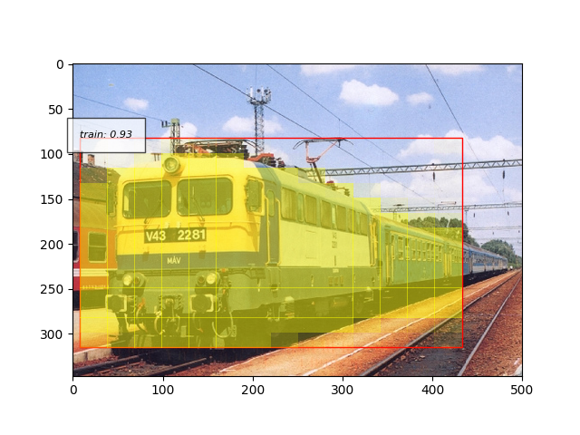
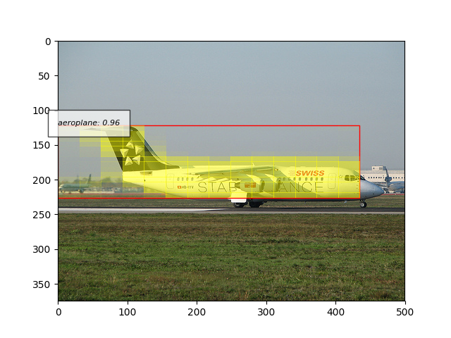
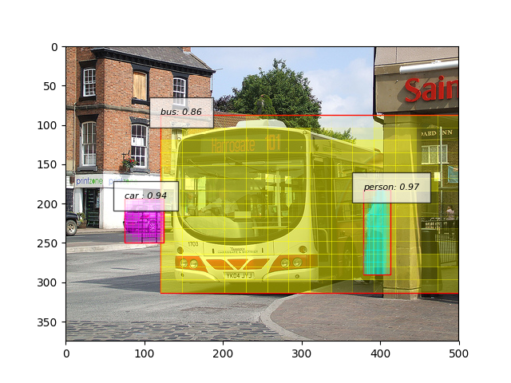
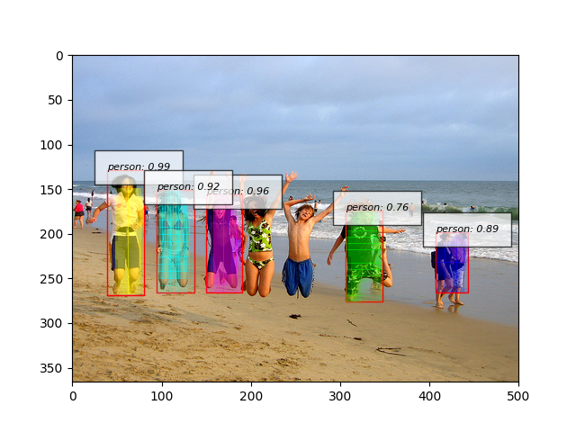
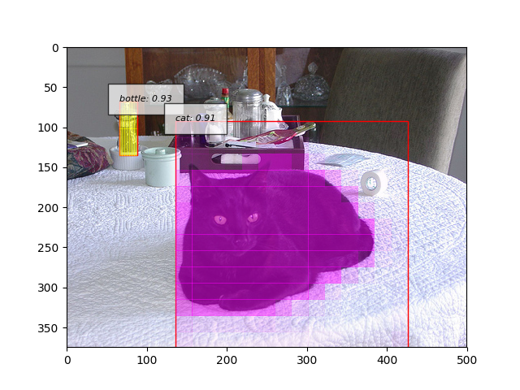

# Mask-RCNN

## Abstract

The aim of this project was to have a simplistice pure python implementation of Mask-RCNN and benchmark it on a popular vision dataset. 

## Dependencies

### Python Libraries

* numpy
* scipy
* pycocotools
* skimage
* opencv2
* chainercv==0.9.0
* chainer==3.1.0

Installing chainer with compatible cupy takes a little work. Using the tag `v3.1.0-python2
` in these docker images is recommended from [here](https://hub.docker.com/r/chainer/chainer/tags/)

### Datasets

Pascal VOC 2012

* Download the Pascal VOC dataset from [here](http://host.robots.ox.ac.uk/pascal/VOC/voc2012/)
* Download additional annotations from SBD from [here](http://home.bharathh.info/pubs/codes/SBD/download.html)

## Running The Code

### Training

* Convert VOC to COCO format using the `voc2coco.py` file.
    * Modify the `SBD_PATH` variable path to folder where you saved the data.
    * Run `python voc2coco.py` to initiate the conversion.
    * It will create converted files `SBD_train2011.json` and `SBD_val2011.json`
    * Once the conversion is complete, it will visualize the images in a loop. 
* Train using the default hyperparams using `python train.py`
    * Atleast 11 GB GPU memory needed, reduce batch_size if needed.

### Testing

* Test on images saved in a folder using `mkdir static && python test.py --modelfile <path to saved model>`
    * Our Best Model can be downloaded from [here](https://drive.google.com/file/d/1uCfkQ0cQqkxhJI__qiCi28QowyJtsYUL/view?usp=sharing)
    * It will save results of file IDs mentioned in `test_sample.txt` in a `static` folder.

## Results

## References

* https://github.com/Ignotus/theano-roi-align
* https://github.com/facebookresearch/Detectron/
* https://github.com/chainer/chainercv/tree/master/examples/faster_rcnn
